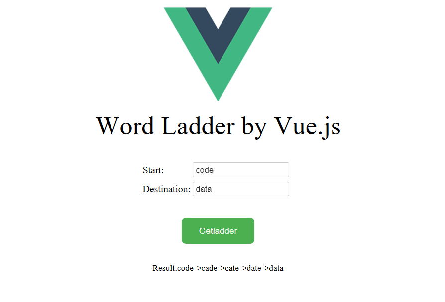
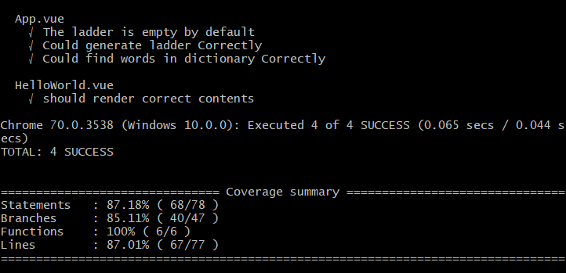

# Wordladder

> A Wordladder demo using Vue.js

The demo uses a very small dictionary contains "code,cade,cate,date,data" five words.

## Project Setup
### Load the page
To load the page at localhost:
``` bash
# install dependencies
npm install

# serve with hot reload at localhost:8080
npm run dev
```
The page at localhost:8080:



### Run unit test
To run unit tests:
``` bash
# build for production with minification
npm run build

# run unit tests
npm run unit
```
The test:


